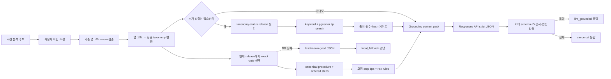
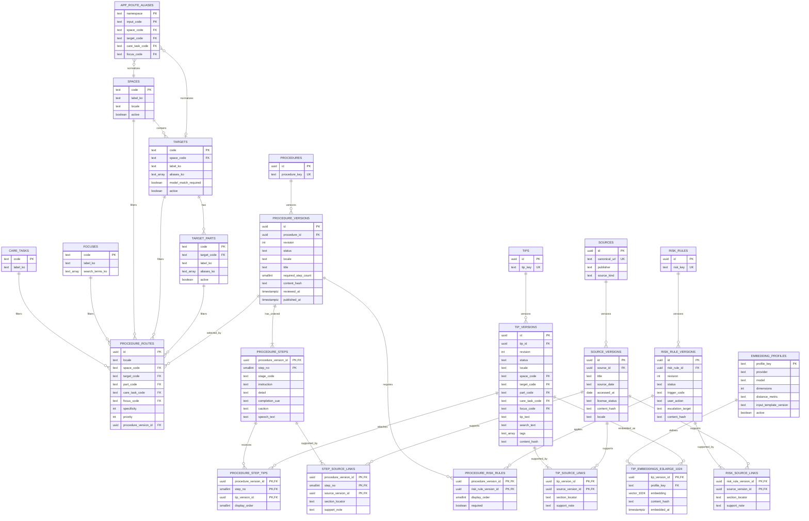
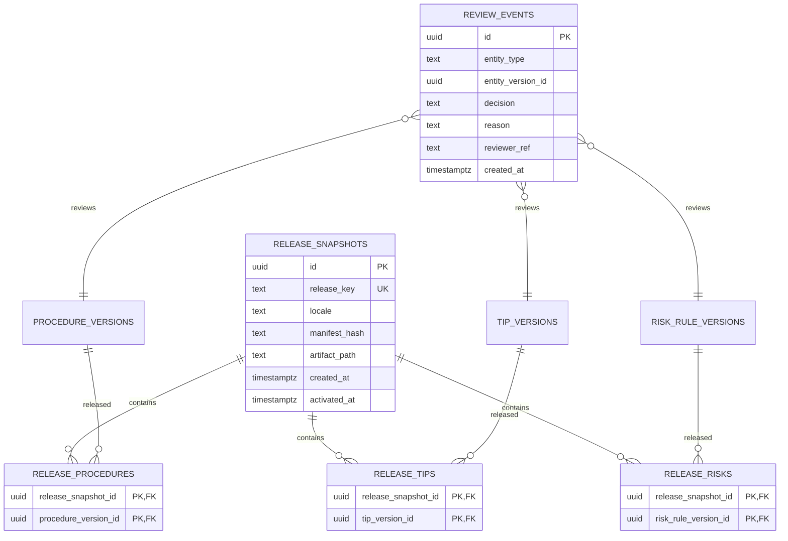

# 한국형 청소 지식베이스 ERD·검색·LLM 연동 계획

- 상태: 설계 완료, Supabase 적용 전
- 기준일: 2026-08-25
- 대상 앱: `clean-master-care-farm-share-20260825`
- 기본 locale: `ko-KR`
- 관련 요구사항: PRD 9·10·13·14장, FR-021~024, AC-018~020

## 1. 목표와 결정

현재 청소 방법은 `static/app.js`의 `buildCarePlan()` 안에 공간·분류별 문장으로 하드코딩되어 있다. 사진 분석용 `/api/analyze`와 청소 단계 생성이 분리돼 있어, 사진에서 확인한 구체 상황이 충분히 반영되지 않고 출처·버전·검수 상태도 추적하기 어렵다.

다음 구조로 교체한다.

1. 관계형 정확 라우팅으로 현재 발행된 정답 절차를 고른다.
2. 절차 단계에 고정된 검수 팁과 위험 규칙을 결합한다.
3. 추가 상황이 있을 때만 같은 공간·대상·부위·과업으로 제한한 pgvector 검색으로 발행 팁을 보충한다.
4. 검색 결과를 근거 ID가 포함된 컨텍스트 팩으로 만들고 OpenAI Responses API에 전달한다.
5. LLM은 검색된 사실을 사용자의 현재 단계에 맞게 설명하되, 엄격한 JSON Schema로만 답한다.
6. 서버가 단계 순서, 참조 ID, 위험 문구, 금지 내용을 검증한 뒤에만 사용자에게 반환한다.
7. Supabase나 OpenAI 장애 시 발행 절차 원문 또는 저장소의 로컬 스냅샷으로 즉시 대체한다.

인터넷 자료 전문을 모아 바로 임베딩하거나, 가장 가까운 문서를 LLM에 넘겨 청소법을 자유 생성하게 하지 않는다. DB에는 공개 근거를 바탕으로 새로 작성하고 사람이 검수한 짧은 절차·팁·위험 문구와 출처 메타데이터만 넣는다.

## 2. 현재 앱과의 연결점

### 현재 입력 계약

`server.py`의 `cleaning_area` 분석과 `static/app.js`는 다음 코드를 사용한다.

- `area_hint`: `desk`, `sink`, `sofa`, `bed`, `shoe_rack`, `bathroom`, `kitchen`, `other`
- `visible_categories`: `organize`, `clean`, `laundry`
- `cleaning_focus`: `water_scale`, `soap_scum`, `grease`, `dust`, `clutter`, `laundry`, `unknown`

`area_hint`에는 공간과 대상이 섞여 있으므로 그대로 taxonomy PK로 사용하지 않는다. `app_route_aliases`에서 기존 입력을 정규화된 공간·대상 코드로 변환해 기존 UI와 저장된 기록의 호환성을 지킨다.

예:

| 기존 입력 | 정규화 공간 | 정규화 대상 |
|---|---|---|
| `sink` | `kitchen` | `kitchen_sink` |
| `sofa` | `living_room` | `sofa` |
| `bed` | `bedroom` | `bed` |
| `shoe_rack` | `entry` | `shoe_cabinet` |
| `bathroom` | `bathroom` | 사용자 선택 또는 일반 경로 |
| `kitchen` | `kitchen` | 사용자 선택 또는 일반 경로 |

### 현재 코드의 단계적 교체

- `/api/analyze`는 사진에서 관찰 가능한 후보를 반환하는 현재 책임을 유지한다.
- 새 `/api/cleaning-guide`가 정규화, 검색, LLM 설명, 검증과 대체 응답을 담당한다.
- `buildCarePlan()`은 새 API가 오프라인·오류 회귀 테스트를 통과할 때까지 로컬 대체 경로로 남긴다.
- 전환 후에는 활성 release와 동등한 JSON 스냅샷을 번들하고, `buildCarePlan()`의 중복 본문을 제거한다.

## 3. 전체 처리 흐름



벡터 유사도는 canonical procedure를 선택하지 않는다. 정답 절차는 명시적인 route 우선순위와 fallback route로만 결정한다.

## 4. 핵심 ERD



## 5. 발행·검수 ERD



발행된 row는 수정하지 않는다. 문구를 바꾸면 새 revision을 만들고, 검수와 자동 게이트를 통과한 뒤 release 포인터를 원자적으로 교체한다.

## 6. 테이블과 품질 게이트

### Taxonomy와 route

- taxonomy는 PostgreSQL enum이 아닌 lookup table로 확장한다.
- API 입력 enum은 현재 앱과 호환을 위해 서버 스키마에서 유지한다.
- route의 후보는 같은 locale과 active release 안에서만 찾는다.
- `target_code`, `part_code`, `care_task_code`, `focus_code`가 더 많이 일치하는 route가 우선한다.
- 구체 route가 없으면 DB에 미리 등록한 일반 route와 `unknown` route를 사용한다. 임의 유사 절차 선택은 금지한다.

### Procedure

- `procedures`는 안정적인 식별자, `procedure_versions`는 불변 revision이다.
- `procedure_steps`의 `step_no`는 1부터 `required_step_count`까지 중복과 누락 없이 존재해야 한다.
- 욕실 기본 청소 route는 PRD에 따라 `required_step_count=6`을 강제한다.
- `stage_code` 후보는 `prepare`, `protect`, `preclean`, `act`, `rinse`, `dry`, `finish`, `pause_check`이며 절차 유형별 허용 순서는 validation 함수가 확인한다.
- 모든 단계에는 사용자가 확인할 수 있는 `completion_cue`를 둔다.

### Tips와 vector search

- 절차에 항상 표시할 팁은 `procedure_step_tips`로 직접 연결하며 벡터 검색을 거치지 않는다.
- 벡터 검색 대상은 현재 release의 `published` tip version뿐이다.
- 검색 전에 locale, space, target, part, care task, focus, 위험 태그를 SQL 조건으로 제한한다.
- 단계당 보조 팁은 최대 2개로 제한하고, 임계값 미달이면 canonical 단계만 반환한다.
- `content_hash`와 embedding row의 hash가 다르면 stale embedding으로 제외한다.
- 한 vector column에는 한 embedding profile만 넣는다. 초기 후보는 `text-embedding-3-large`, 1024차원이며 `text-embedding-3-small`과 한국어 평가셋으로 비교 후 확정한다.
- 작은 초기 corpus는 exact cosine scan으로 시작하고, 데이터·지연 측정 뒤에만 HNSW를 추가한다.

### Risk rules

- 중단·전문 도움·환기·보호구·혼합 금지 같은 안전 규칙은 일반 팁과 분리한다.
- 위험 규칙은 LLM 호출 전에 서버에서 붙이고 `required=true`이면 최종 문장에 반드시 포함한다.
- 넓거나 반복되는 곰팡이, 가스 냄새, 전기 이상, 누수·역류, 깨진 유리, 고소 작업, 분해 필요는 검색 점수와 무관하게 우선 처리한다.
- 제조사·모델별 분해는 정확한 공식 설명서와 모델 확인이 없는 경우 발행할 수 없다.

### Sources와 저작권

- 원문 전문, 긴 인용, 이미지·도표를 저장하지 않는다.
- URL, 기관, 제목, 문서일, 접근일, 라이선스 상태, 원문 hash와 적용 범위만 저장한다.
- 사용자용 문장은 근거를 바탕으로 새로 짧게 작성하고 step·tip·risk 단위로 source version을 연결한다.
- source가 하나도 없는 procedure step, tip, risk는 `published`로 전환할 수 없다.

## 7. LLM grounding contract

### 컨텍스트 팩

```json
{
  "request": {
    "locale": "ko-KR",
    "area_hint": "sink",
    "visible_categories": ["clean"],
    "cleaning_focus": "water_scale",
    "space_code": "kitchen",
    "target_code": "kitchen_sink",
    "part_code": "drain_strainer",
    "user_confirmed": true,
    "observations": ["사진에서 확인된 표현만"]
  },
  "retrieval": {
    "release_key": "ko-kr-2026-08-001",
    "procedure_version": {
      "id": "uuid",
      "required_step_count": 6
    },
    "steps": [],
    "step_tips": [],
    "risk_rules": [],
    "sources": []
  }
}
```

사용자가 확정하지 않은 사진 후보는 사실 입력으로 쓰지 않는다. 자유 입력을 추가하더라도 검색 요청 처리 후 DB와 로그에 원문을 저장하지 않는다.

### 프롬프트 규칙

- retrieval 객체만 청소 사실의 근거로 사용한다.
- step ID, step 순서, 필수 위험 문구를 유지한다.
- 검색되지 않은 제품, 성분, 사용량, 희석비, 접촉 시간, 재질 적합성, 전문 판단을 추가하지 않는다.
- 이해하기 쉬운 한국어와 행동 단위로 설명하되, 근거가 부족하면 추측 대신 `needs_user_confirmation=true`를 반환한다.
- 사용자를 평가하거나 청결도·성실성·질환·정신건강을 추정하지 않는다.

### LLM 출력 Schema

```json
{
  "procedure_version_id": "uuid",
  "release_key": "ko-kr-2026-08-001",
  "title": "싱크대 거름망 청소",
  "summary": "지금 보이는 거름망부터 짧게 정리해요.",
  "steps": [
    {
      "step_id": "uuid",
      "step_no": 1,
      "stage_code": "prepare",
      "instruction": "검수된 사실을 바탕으로 한 행동 문장",
      "detail": "단계별 구체 요령",
      "completion_cue": "완료 확인 기준",
      "caution": null,
      "tip_version_ids": ["uuid"],
      "risk_rule_version_ids": [],
      "source_ids": ["uuid"]
    }
  ],
  "needs_user_confirmation": false
}
```

### 서버의 최종 검증

- JSON Schema와 모든 enum이 유효한가
- `procedure_version_id`와 `release_key`가 context와 같은가
- 단계 수, `step_no`, `step_id`, `stage_code`와 순서가 canonical과 같은가
- tip, risk, source ID가 context에 실제로 포함됐는가
- required risk rule이 빠지거나 의미가 약화되지 않았는가
- 금지 내용과 평가 문구가 추가되지 않았는가

하나라도 실패하면 모델 문장을 버리고 canonical 문구를 반환한다. 모델 응답 일부를 섞어 복구하지 않는다.

## 8. `/api/cleaning-guide` 계약

### 요청

```json
{
  "locale": "ko-KR",
  "area_hint": "sink",
  "visible_categories": ["clean"],
  "cleaning_focus": "unknown",
  "target_code": "kitchen_sink",
  "part_code": "drain_strainer",
  "user_confirmed": true,
  "observations": ["거름망에 눈에 보이는 잔여물이 있음"]
}
```

### 응답

```json
{
  "mode": "llm_grounded",
  "release_key": "ko-kr-2026-08-001",
  "procedure_version_id": "uuid",
  "title": "싱크대 거름망 청소",
  "steps": [],
  "stop_rules": [],
  "needs_user_confirmation": false
}
```

`mode`는 `llm_grounded`, `canonical`, `local_fallback` 중 하나다. 어느 모드에서도 사용자가 미션을 진행할 수 있어야 한다.

## 9. 한국형 corpus 범위

### 1차: 현재 흐름과 욕실 15개

- 현재 `buildCarePlan()`의 `desk`, `sink`, `sofa`, `bed`, `shoe_rack`, `bathroom`, `kitchen`, `other` 일반 경로
- 변기 안쪽·테두리와 외부
- 전기 비데 외부 표면
- 세면대 볼·오버플로·헤어캐처
- 수전 본체·출수구 외부
- 샤워헤드·호스 외부
- 거울·샤워부스 유리
- 욕조 안쪽·테두리·배수마개
- 벽 타일·바닥 타일·줄눈
- 실리콘 코킹의 작은 흔적과 파손 확인
- 바닥 배수구·트랩·봉수부
- 환풍기 그릴·탈착식 커버
- 문 하부 레일과 구석

### 2차: 한국형 주방

- 싱크볼·수전·배수구·거름망
- 가스레인지 버너 주변과 상판
- 인덕션·전기레인지 상판
- 후드 외부와 제조사상 세척 가능한 필터
- 식탁·의자
- 냉장고 내부 선반·서랍·내벽
- 음식물 쓰레기통 외부와 접근 가능한 내부

### 3차: 거실·침실·현관·발코니·다용도실

- 온돌 바닥·문턱·모서리
- 소파 표면과 접근 가능한 틈
- 침대 주변·침구 정리·침대 아래 접근 영역
- 책상·선반·케이블 주변
- 현관 바닥·신발장·중문 하부 레일
- 미닫이 샷시 레일·배수 구멍·방충망
- 발코니 바닥·배수구·보조 싱크
- 세탁기 외부·빨래건조대·노출 설비 외부
- 하향식 피난구·경량칸막이·대피 통로의 적치 금지 상태

한국형 태그 후보는 `kr_apartment`, `kr_villa`, `kr_one_room`, `korean_wet_room`, `ondol_floor`, `built_in_kitchen`, `sliding_sash`, `nonheated_balcony`, `monsoon`, `yellow_dust`다.

처음부터 모든 인터넷 청소법을 모으지 않는다. coverage matrix의 빈칸을 기준으로 검수 완료 절차를 15개, 30개, 이후 80~120개로 확장한다.

## 10. 출처 정책과 대표 자료

우선순위:

1. 한국 정부·공공기관의 안전·설비·주거관리 자료
2. 해당 설비 제조사의 공식 사용설명서와 유지관리 문서
3. 대학·병원·공인 연구기관의 생활환경 자료
4. 국내 자료가 부족한 안전 사항에 한해 해외 정부기관 자료

제휴 블로그, 출처 없는 살림 팁, 사용자 게시물, 자동생성 문서와 제품 판매 홍보 문구는 발행 근거로 사용하지 않는다. 현재 `buildCarePlan()`에서 이런 출처를 사용한 문구는 corpus 이관 전에 다시 검수한다.

대표 설계·조사 자료:

- [Supabase semantic search](https://supabase.com/docs/guides/ai/semantic-search)
- [Supabase hybrid search](https://supabase.com/docs/guides/ai/hybrid-search)
- [Supabase HNSW indexes](https://supabase.com/docs/guides/ai/vector-indexes/hnsw-indexes)
- [Supabase RAG with permissions](https://supabase.com/docs/guides/ai/rag-with-permissions)
- [OpenAI embeddings API](https://developers.openai.com/api/reference/ruby/resources/embeddings/methods/create)
- [국토교통부 기계설비 유지관리 표준안](https://www.molit.go.kr/portal/common/download/DownloadMltm2.jsp?FileName=%28%EB%B0%B0%ED%8F%AC%EC%9A%A9%29%EA%B8%B0%EA%B3%84%EC%84%A4%EB%B9%84_%EC%9C%A0%EC%A7%80%EA%B4%80%EB%A6%AC_%EB%B0%8F_%EC%84%B1%EB%8A%A5%EC%A0%90%EA%B2%80_%EA%B3%84%ED%9A%8D_%EC%88%98%EB%A6%BD_%ED%91%9C%EC%A4%80%EC%95%88.pdf&FilePath=portal%2FDextUpload%2F202207%2F20220711_173120_653.pdf)
- [LH 욕실 배기팬 관리](https://heri.lh.or.kr/housing/viewMenu?housingmenuid=002&menuid=001009001)
- [한국소비자원 주택 안전사고 예방](https://www.kca.go.kr/webzine/board/view?div=kca_2207&linkId=436&menuId=MENU00307)
- [환경부 실내공기질 관리](https://me.go.kr/home/web/board/read.do?boardId=1497330&boardMasterId=713&menuId=10392)
- [LG전자 가스레인지 청소](https://www.lge.co.kr/support/solutions-1418623130664)
- [LG전자 인덕션 상판 청소](https://www.lge.co.kr/support/solutions-20152789862413)
- [미국 EPA 가정 내 곰팡이 청소](https://www.epa.gov/mold/mold-cleanup-your-home)
- [미국 CDC 곰팡이 청소 안전](https://www.cdc.gov/mold-health/about/clean-up.html)

## 11. 수집·검수·발행 흐름

1. 허용 기관과 문서 URL을 등록한다.
2. 제목, 기관, 문서일, 접근일, 라이선스, hash와 적용 범위를 기록한다.
3. 원문 복제가 아닌 자체 작성한 짧은 단계·팁·위험 문구 초안을 만든다.
4. 공간·대상·부위·과업·focus·stage와 위험 태그를 붙인다.
5. 단계 수·순서, 금지어, source coverage, 위험 문구, 모델 확인 요구를 자동 검사한다.
6. 사람이 출처 대조, 한국 주거 적용성, 실행 가능성과 안전성을 검수한다.
7. 게이트를 통과한 version만 published로 바꾼다.
8. published tip만 현재 embedding profile로 임베딩한다.
9. 한국어 검색·LLM 평가를 통과한 release만 active로 전환한다.
10. 같은 release를 JSON 스냅샷으로 내보내 앱의 fallback에 포함한다.

## 12. 보안과 개인정보

- 지식 base table은 별도 `kb` schema에 두고 공개 Data API schema에서 제외한다.
- 모든 base table에 RLS를 활성화하고 `anon`, `authenticated`의 직접 쓰기 권한을 철회한다.
- 브라우저는 Supabase를 직접 검색하지 않고 FastAPI만 호출한다.
- service-role과 OpenAI 키는 서버 환경변수에서만 읽고 응답·로그·프런트 번들에 넣지 않는다.
- 게시·임베딩 생성·검수는 관리자 서버 경로만 수행한다.
- 사용자 사진, 이미지 embedding, 자유 입력 원문, 포인트, 돌봄 농장 상태를 `kb`에 저장하는 API를 만들지 않는다.
- 로그에는 release와 사용한 record ID, 지연, 비식별 오류 코드만 남긴다.

## 13. 평가 기준

한국어 평가셋에는 동의어, 띄어쓰기, 오타, 구어체, 같은 focus의 다른 공간, 여러 대상 혼합, 자료 없는 long-tail, 금지 제품·성분·재질 질문, `unknown`, 안전 중단 상황을 넣는다.

초기 통과 기준:

- canonical route accuracy: 100%
- 욕실 6단계와 그 외 `required_step_count` 순서 보존: 100%
- published 지식의 source coverage: 100%
- 필수 위험 규칙 누락: 0건
- context 밖 ID 참조와 사실 생성: 0건
- source 없는 published 지식: 0건
- stale embedding 검색: 0건
- 사진·사용자 원문 저장: 0건
- Supabase/OpenAI 장애 시 미션 중단: 0건

vector threshold는 예시 값을 복사하지 않고 골든 질의의 Recall@2, MRR, nDCG@5와 오답 억제율로 정한다.

## 14. 장애 대체 경로

| 장애 | 동작 |
|---|---|
| OpenAI 사진 분석 실패 | 현재처럼 사용자가 공간·과업·focus를 직접 선택 |
| Embedding 실패 | exact route + 고정 step tips만 사용 |
| LLM 구조화 출력 실패 | canonical DB 문구 반환 |
| Supabase timeout·장애 | active release의 last-known-good JSON 반환 |
| DB와 snapshot 모두 실패 | 현재 검증된 로컬 `buildCarePlan()` 경로 반환 |

입력 상태, 포인트, 기록과 미션 진행은 어느 장애에서도 잃지 않는다. `/health`는 `openai`, `knowledge_db`, `knowledge_release`의 정상·저하 상태만 노출하고 비밀값과 상세 DB 오류를 반환하지 않는다.

## 15. 구현 작업 계획

### K01 — Supabase schema와 보안

- Supabase 플러그인 연결과 개발 프로젝트 확인
- 실제 schema, migration history, extension, exposed schema 조회
- `vector`, UUID extension 가능 여부와 버전 확인
- 이 문서의 taxonomy, procedure, tip, risk, source, release, review, embedding table migration 작성
- FK, unique, check, immutable publish, RLS, grants, exact-route 함수를 테스트

완료 조건: 빈 DB에 재현 가능한 migration, 익명 base table 접근 거부, 발행 전 데이터 조회 차단, 단계 validation 통과.

### K02 — 최소 corpus와 local snapshot

- 현재 `buildCarePlan()` 경로와 욕실·싱크대 거름망 우선 이관
- 출처가 약한 기존 블로그 기반 문구를 공식·공공 근거로 교체하거나 제외
- step·tip·risk별 source link와 사람 검수
- 자동 lint, source coverage, release manifest와 JSON snapshot 생성

완료 조건: 현재 핵심 경로를 DB와 snapshot에서 동일하게 재현하고, 욕실 6단계·필수 안전 문구 100% 보존.

### K03 — route·retrieval·context builder

- 앱 enum 정규화 adapter
- exact route → 고정 팁 → 제한된 hybrid/vector tip 검색
- active release와 content/embedding hash 검사
- LLM에 보낼 최소 grounding context pack 생성
- 사진·자유 입력 비저장 회귀 테스트

완료 조건: 골든 route 100%, cross-space 오검색 0건, 검색 결과의 모든 ID와 출처 재현 가능.

### K04 — Responses API 설명과 validator

- 기존 raw Responses API 호출 코드를 재사용 가능한 client로 분리
- strict JSON Schema의 청소 안내 요청 구현
- context ID, 단계, 순서, 위험 문구, 금지 문장 검증기 구현
- canonical fallback과 timeout 적용
- PRD와 `server.py`의 모델명 불일치를 확인하고 한 설정으로 통일

완료 조건: context 밖 사실·ID 0건, 강제 오류 시 검증 전 문장 미노출, canonical fallback 100%.

### K05 — FastAPI와 프런트 연결

- `POST /api/cleaning-guide`
- 응답 `mode`와 release/version ID 표시 가능한 상태 관리
- `buildCarePlan()`을 network/local fallback으로 이동
- 단계별 detail, completion cue, caution, 출처 보기와 음성 안내
- 360/768/1440px 및 네트워크 실패 검증

완료 조건: 온라인·Supabase 장애·OpenAI 장애 모두에서 미션 완주, 기존 포인트와 전후 기록 회귀 통과.

### K06 — 한국형 coverage 확장

- 욕실 15개 → 주방 → 거실·침실·현관 → 발코니·다용도실 순서
- 사용자 선택 UI에 target/part가 생긴 뒤 route를 활성화
- 사진 분석 enum 확대는 별도 평가와 PRD 변경 후 진행

완료 조건: 공간별 route 정확도 100%, 미발행 또는 다른 공간 팁 노출 0건.

## 16. 다음 Supabase 세션 첫 행동

1. `PRD.md`, `AGENTS.md`, 이 문서, `docs/DEVELOPMENT_PRIORITY.md`, INDEX와 최신 개발일지를 읽는다.
2. Supabase 플러그인 연결 상태를 확인한다.
3. 적용 대상이 개발 프로젝트인지 읽기 전용으로 확인한다. 프로젝트가 불명확하면 DDL을 실행하지 않는다.
4. 현재 schema, migration history, enabled extensions, exposed schemas와 RLS 상태를 조회한다.
5. 이 ERD와 실제 상태의 충돌을 기록한다.
6. K01 migration과 rollback 전략을 작성하고 적용 전 변경 대상을 확인한다.
7. 적용 후 catalog query, RLS, publish validation, exact route 테스트를 실행한다.
8. 같은 작업 단위의 마지막 변경으로 개발일지와 INDEX를 갱신한다.

실제 Supabase 프로젝트 상태를 보기 전에는 extension 버전, index 파라미터, 권한과 exposed schema를 추측해 고정하지 않는다.
